# Honors Physics Reference Notes

Jacky Song

* Time vs. Time interval
  * Time is "when?" and is represented within physics with $t$
  * A time interval is "how long?" and is represented within physics with $\Delta t$
* In physics it is important to *not* overstate the accuracy of numbers, do not give the answer to more precise than 4SF!
* A model is a simplified representation of a more complex real-world object

## Percent Error

* We calculate percent error with this formula:

$\mathrm{Percent\ Error} = \left(\frac{\mathrm{Experimental\ Value} - \mathrm{Predicted\ Value}}{\mathrm{Predicted\ Value}}\right) \cdot 100$

* The precent error is usually given as the absolute value of the result from the formula
* Generally, if an experiment's results are more than 5% off from the predicted value, then its results are inconsistent with prediction

## Distance, Position, and Displacement

* *Distance* is the measure of space between two points, the total distance, regardless of direction, and is represented with $x$ - it is _always_ positive (+)
* *Position* is the distance and direction (+ or -) from an agreed reference point
* *Displacement* is the difference of an object's new position from its original position, and is represented with $\Delta x$
  * To find the displacement, we subtract the *initial position* from the *final position* of the moved object
  * When you are describing a displacement, we must not forget to specify a direction - positive or negative, north or south, etc.
  * This is because displacement is a _vector_ 

### Modeling Position and Displacement

* The following model is of an object that is initially at a position of +5m and is displaced by -2m:
  * Because displacement is a difference between positions, $\Delta x = x_{final} - x_{initial} = (3) - (5) = -2$
  * So, we can say that the displacement is -2m
  * This also means that the displacement has a *magnitude* (amount) of 2m in the *negative direction*
  * Unlike displacement, the _distance_ is 2 meters, because 2 meters is the amount of "space" between 3 and 5, and distance can never be negative
* The above is an example of **linear motion** (also called rectilinear motion) - an object moving at constant speed will displace a constant distance during each unit time interval

## Velocity and Acceleration

* **Speed** is ratio of distance_ to the time interval; that is, $v = \frac{x}{\Delta t}$
* **Velocity** is a ratio of _displacement_, not distance, to the time interval; that is, $\vec v = \frac{\Delta x}{\Delta t}$ (note the arrow on top)
  * *Constant velocity* is a state of constant displacement per unit time interval; the standard unit of measurement is in units distance over units time, (e.g. meters per second)
    * An object in motion moves at constant speed unless acted upon by an external force (Newton's 1st law)
    * When you are asked to *describe the motion* of an object at constant velocity, then say that *"the object is in motion with a velocity of $n$ meters per second"*
    * Velocity is the **slope** of a **position-time graph** - a positive slope is a positive velocity, a negative slope is a negative velocity
    * If velocity is **positive**, we are moving forwards
    * If velocity is **negative**, we are moving backwards
  * The **CV model** (constant velocity motion model) can be represented by $y = \frac{\Delta \vec x}{\Delta t} + x_0$ or more simply $y = mx + b$
* Speed at a certain time is the magnitude of the velocity at that moment of time
* **Acceleration** refers to the rate of change of velocity over time - it can be positive or negative
  * Thus $A = \frac{\Delta v}{\Delta t}$ and acceleration is the **slope** of a **velocity-time graph**
  * Acceleration can have either a negative or a positive direction:
    * Positive acceleration is the same as *speeding up* in the positive direction
    * Negative acceleration is the same as *slowing down* in the positive direction or *speeding up* in the negative direction
  * No matter whether the *velocity* is positive or negative:
    * If a velocity-time graph has a **positive slope** then acceleration is positive
    * If a velocity-time graph has a **negative slope** then acceleration is negative
    * If the velocity-time graph has no slope (i. e. is a flat line) then there is no acceleration
  * When acceleration and velocity have the *same signs* then the object is speeding up
  * When acceleration and velocity have *opposite signs* then the object is slowing down
  * Remember - a negative velocity can have a positive acceleration, and a negative acceleration can have a positive velocity!
  * Negative acceleration results in a speeding up in the backwards direction because the frame of reference is positive - very unintuitive but true!

### Example velocity and speed question

Suppose you were given this distance-time graph:

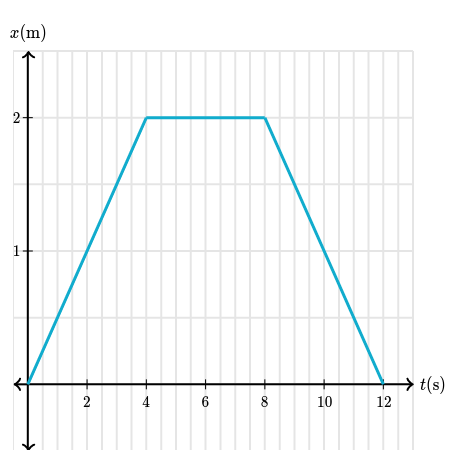

Let's try to find the velocity from between 2 seconds and 12 seconds.

Again, remember that $\vec v = \frac{\Delta x}{\Delta t}$. Velocity is $\vec v$, with that little arrow on top - don't mistake it for "plain" $v$ which is speed.

$\Delta x$ is the velocity, which is the difference of position, so:

$$
\Delta x = x_{final} - x_{initial} = x_{12s} - x_{2s} = (0) - (1) = -1
$$

$\Delta t$ is the time interval, which is 12 seconds - 2 seconds = 10 seconds.

So we can finally solve using the velocity equation:

$$
\vec v = \frac{-1\mathrm{\ m}}{10\mathrm{\ s}} = -0.1\mathrm{\ m/s}
$$

Okay, so we know the velocity, what about the speed? Be careful not to confuse these two!

Speed is calculated with $v = \frac{x}{\Delta t}$.

We know that the total distance is 2m (forwards) + 0m + 2m (backwards), but distance doesn't care which direction they are in, which is why they are all positive. So, the total distance is 4m combined, over 10 seconds.

So, we can solve using the speed (not velocity!) equation:

$$
v = \frac{4\mathrm{\ m}}{10\mathrm{\ s}} = 0.4\mathrm{\ m/s}
$$

**Disclaimer:** I am a forgetful person, and I will write _both_ velocity and speed using $v$ at times instead of using the proper $\vec v$ and $v$ distinction. Most physics uses velocity anyways, not speed. Just pretend that everytime I use $v$, I actually mean $\vec v$ (velocity).

## Examples of Velocity and Position Time Graphs

| Position Time Graph                                                 | Velocity Time Graph                                                 | Velocity (+/-)               | Acceleration (+/-/0)             | Description                                                                 |
| ------------------------------------------------------------------- | ------------------------------------------------------------------- | ---------------------------- | -------------------------------- | --------------------------------------------------------------------------- |
| 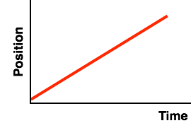 |  | Positive constant velocity   | No acceleration (constant speed) | The object is moving at constant speed, neither speeding up or slowing down |
| 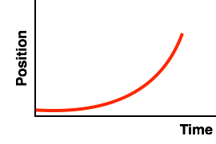      | 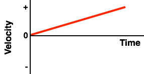      | Positive increasing velocity | Positive acceleration            | The object is speeding up                                                   |
| 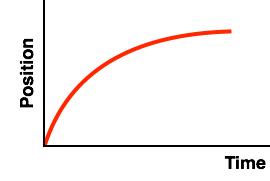      | 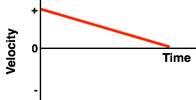      | Positive decreasing velocity | Negative acceleration            | The object is slowing down                                                  |
| 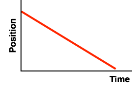 |  | Negative constant velocity   | No acceleration                  | The object is moving at constant speed, neither speeding up or slowing down |
| 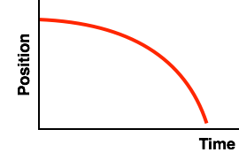      | 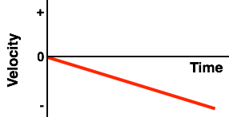      | Negative increasing velocity | Negative acceleration            | The object is speeding up                                                   |
| 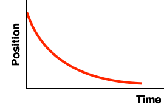      | 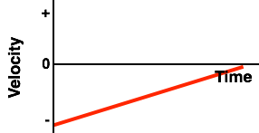      | Negative decreasing velocity | Positive acceleration            | The object is slowing down                                                  |

* On a velocity-time graph, if (and only if) a line crosses the y-axis from +velocity to -velocity, then we can say that the object has *changed direction*
* Lines that head away from the x-axis are speeding up; lines that head towards the x-axis are slowing down

## Kinematics Equations

The kinematics equations are the following:

$$
1.\ v  = v_0 + at
$$

$$
2.\ \Delta x = \left(\frac{v + v_0}{2}\right)t
$$

$$
3.\ \Delta x = v_0 t + \frac{1}{2}at^2
$$

$$
4.\ v^2 = (v_0)^2 + 2a\Delta x
$$

* The 4 kinematics equation relate the 5 kinematic variables:
  * $\Delta x$ (displacement)
  * $t$ (time)
  * $v_0$ (initial velocity)
  * $v$ (final velocity)
  * $a$ acceleration
* As long as we know 3 out of the 5 variables we can use a kinematics equation
* The equations presume that an object is under **constant acceleration** during the specified time interval (that includes if acceleration is equal to 0)
  * You can tell that an object has constant acceleration if the object in motion is in *free fall* (freely flying motion)
    * This applies to any objects being thrown up or falling down (such as if you throw a book in the air, an unpowered trolley rolling up/down a hill, or if a brick falls off a building)
    * A freely flying object is accelerating only due to the influence of gravity and so has a constant acceleration of $9.81 \mathrm{m/s^2}$ (**positive** if falling down, **negative** if flying up)
    * Be sure to not use the *wrong sign* (+ or -) for freely flying objects!
  * We can also presume that the object is in constant acceleration if the question assumes that the object's acceleration is constant
    * This means even if the object is not in freely flying motion (such as if it was a car moving forward or kicking a ball forwards) we can apply the kinematics equations
* We can find which formula we need to use by finding the "missing variable" - the variable the question doesn't give you and you don't need to find
  * If the question asks *"What is the acceleration of a book that was kicked forward with an initial velocity of $v_0 = 5\ \mathrm{ m/s}$, after which it took a time interval of $t = 3s$ for the book to slide a displacement of $8m$?"*, then the missing variable is $v$ (final velocity)
  * Remember that each formula has one "missing variable":
    * $v = v_0 + at$ is the formula *missing* $\Delta x$
    * $\Delta x = \left(\frac{v + v_0}{2}\right)t$ is the formula *missing* $a$
    * $\Delta x = v_0 t + \frac{1}{2}at^2$ is the formula *missing* $v$
    * And $v^2 = (v_0)^2 + 2a\Delta x$ is the formula *missing* $t$
  * To solve our book kinematics question, we know that because $\Delta x = v_0t + \frac{1}{2}at^2$ is the equation missing $v$, same as the question, we can use it to solve the equation
  * Plugging in the values $8 = (5)(3) + \frac{1}{2}a(3^2)$ we get the result that $8 = 135a$ so $a = 16.875\ \mathrm{m/s}$

## Free Fall

* An important distinction has to be made between the magnitude and vector (direction) of acceleration and velocity:

|              | Magnitude                        | Vector/Direction                                 |
| ------------ | -------------------------------- | ------------------------------------------------ |
| Acceleration | Constant - $10 \mathrm{m/s^2}$   | Always negative                                  |
| Velocity     | Always positive but not constant | Positive when going up, negative when going down |

* When an object is thrown up or falls down it has **constant** acceleration because earth's gravity pulls the object towards earth with a constant acceleration. If it is thrown up its velocity decreases; if it is falling down its velocity increases.
* Objects accelerate at a net constant rate of -10m/s (if going up) or +10m/s (if falling down), because even though the acceleration of free fall is always -10m/s^s, when the object rises, the acceleration is in the opposite direction, which makes it negative, and when the object falls, the acceleration is in the same direction, which cancels out the negative

* When the object is thrown up, the vector (direction) of the velocity is upwards; once it falls down, the velocity (direction) of its velocity is downward
  * However, no matter whether the ball is moving up, still, or falling down, the acceleration from Earth's gravity is **always constant**
  * Remember that when the direction of the velocity and acceleration are **opposite**, the object slows down - that happens when the object moves up
  * When the direction of the velocity and acceleration are the **same**, the object speeds up - that happens when the object falls down

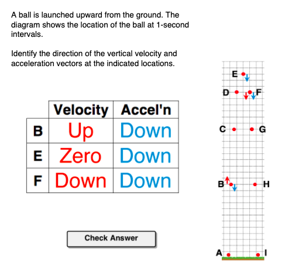

## Forces and motion

* Forces are an **interaction** (push or pull) that acts upon or occurs between any two objects
* **Balanced** forces cancel each other out
  * If forces are balanced, then acceleration is always zero
  * Conversely, a zero acceleration would imply the forces are balanced
* **Unbalanced forces** do not cancel each other out
  * Unbalanced forces mean acceleration in the direction of the _net force_
    * To be more precise (you do **not** need to remember this!) this is true only within the local (inertial) reference frame
* **Net force** is the _sum_ of all the forces on an object
  * Balanced forces result in a net force of 0
  * Unbalanced forces result in a net force in the _direction_ of the force with a greater magnitude
  * Remember: in a system, the net force is in the **direction of the acceleration**, and vice versa
* It is wrong to say "an object _has_ a force" because a force always acts _between_ objects
* **Inertia** is the tendency for mass to resist changes in motion
* Remember: a moving object **does not** need to have a force pushing it forward!
  * It's only **changes in motion** that require forces to be present!
  * If an object is moving at constant speed, then its motion is often the result of inertia, not a force!

## Objects and systems

* An **object** in physics is any piece of matter
* A **system** is a collection of objects that have some meaningful relationship to each other
	* Most things in the world are systems
	* For example, the Earth is a system made of trillions of objects (rocks, trees, air molecules, etc.)
	* The human body is a system made of milions of objects (cells, organs, DNA, etc.)
* We use the particle model to represent objects and systems - we reduce the complexity of objects and systems by describing them as existing entirely at one position

## Mass

* Mass is a measure of how much stuff something is made of
* Mass is typically measured in **kilograms**
* The acceleration of an object by the force of gravity is called **weight**
* Mass has two properties:
  * Mass attracts other masses (gravitation)
  * Mass maintains a constant velocity (tendency)
* We measure weight by measuring the force required to balance the force of gravity so that the object is motionless
* Mass and weight are related by the equation $F = mg$, where $F$ is the weight (which is the force of gravity, measured in Newtons), $m$ is the mass of the object, and $g$ is the acceleration of free fall (the acceleration of any object at rest due to gravity)
  * Note that $g$ is _also_ the gravitational field strength, which is identical to the acceleration of free fall (so the two terms are interchangeable)

## Newton's First Law

Newton's first law says that an object in motion remains in motion, unless acted on by an unbalanced force. This is often called the law of **inertia**, and it's why stationary objects remain stationary while moving objects stay moving. No matter whether the object is stationary, or moving, it moves with constant velocity - that is, the acceleration is $0\ \mathrm{m/s^2}$. And because acceleration is zero, we know that all the forces acting on that object are *balanced*.

The big takeaway here should be that **forces don't keep objects moving**. Instead, inertia (which is the tendency for objects to "keep doing what they're doing") is what keeps them moving. What forces actually do is to *change* how an object moves - making them speed up, slow down, change direction, etc.

However, notice the condition *"....unless acted on by an unbalanced force"*. This means that as soon as one force acting on the object becomes stronger than another, the forces are unbalanced, and the first law doesn't apply. What happens if the forces become unbalanced? Newton's [Second Law](#newtons-second-law) provides the answer.

## Different kinds of forces

* There are **non-contact** or field forces, and **contact** forces
* **Gravity** is the attraction between objects and is experienced by every object on or near Earth
* **Friction** is the resistive force between parallel objects in relative motion while in contact
* **Normal force** is the push from the surface of a solid object as other objects press into it, when an object is perpendicular to the surface
  * Normal forces **only exist** if the two objects remain in contact and neither object is in free fall; otherwise, there is no normal force
* **Resistive forces**, such as air resistance (drag) and friction, are forces between objects in relative motion
  * Drag is resistive force that occurs when an object moves through a fluid (liquid or gas)
  * Friction occurs when two objects are in contact
* **Tension** is the pull from a rope or cord
* **Applied force** is the general term for a push or pull

## Force notation

* We notate forces using a single letter abbreviation for:
  * 1) The type of force
  * 2) The object affected by the force (the "feeler")
  * 3) The object that applies the force (the "dealer")
* For instance:
  * $F_{gbe}$ might mean “force of gravity on the book from the earth” 
  * $F_{npf}$ might mean “normal force on the person from the floor”
  * $F_{ptf}$ might mean “force of the push on the table from the foot”
* There aren’t strict rules about what letters to use for the objects, but **be consistent**!

## Force Diagrams

* Force diagrams allow us to model the forces acting on an object and analyze their interactions
* Objects do **not** necessarily always have four forces acting upon them
* Force diagrams can be rotated if the object is on an incline
* The forces are represented by arrows
  * The magnitude is represented by the length of each arrow
  * Each label tells us the name of the force
  * Equality marks are used on force diagrams to indicate when two forces are the same magnitude (size) or not
* Note: in some cases there are less than 4 forces acting on an object, because objects in motion stay in motion through inertia, not through a force
* Here are some tips in finding the forces necessary for a force diagram:
  * If the diagram represents an object on Earth or close to Earth/in the air (which will be virtually all of the questions you will ever see) the downward force of **gravity** is present
  * If the diagram represents an object pulled by a _cord or rope_, the tension force is present and points upward
  * If the diagram represents an object pushed/pulled by a person directly, the applied force is present

### Force diagrams of standard situations

Many questions follow a standard template, which can be reference here:

#### Category A: Pulling an object up with a rope

Example: Draw a force diagram of the forces acting on a bucket of water that is being raised from the well at constant speed.

| Force               | Present?                |
| ------------------- | ----------------------- |
| Normal              | No                      |
| Gravity             | **Yes**                 |
| Applied             | No                      |
| Friction            | No                      |
| Tension             | **Yes**                 |
| Air resistance/drag | Yes (though negligible) |

#### Category B: Flying ball/Falling skydiver

Example: Draw a force diagram of the forces acting on a ball flying in a parabolic trajectory, or the forces acting on a skydiver falling through the air at constant speed.

Note: Be aware that the force of **lift** is sometimes also drawn on a flying ball's force diagram, as the Magnus effect causes lift on a spinning body. In all cases, lift is opposite to the direction of gravity. However, if there is no lift present, then the ball is moving forward under the effect of inertia.

| Force               | Present? |
| ------------------- | -------- |
| Normal              | No       |
| Gravity             | **Yes**  |
| Applied             | No       |
| Friction            | No       |
| Tension             | No       |
| Air resistance/drag | **Yes**  |

### Category C: Sliding Object

Example: Draw a force diagram of the forces acting on a book that is sliding across the table.

| Force               | Present? |
| ------------------- | -------- |
| Normal              | **Yes**  |
| Gravity             | **Yes**  |
| Applied             | No       |
| Friction            | **Yes**  |
| Tension             | No       |
| Air resistance/drag | **Yes**  |

### Category D: Inclined slope

Example: Draw a force diagram of the forces acting on a brick stationary on an inclined slope.

| Force               | Present? |
| ------------------- | -------- |
| Normal              | **Yes**  |
| Gravity             | **Yes**  |
| Applied             | No       |
| Friction            | **Yes**  |
| Tension             | No       |
| Air resistance/drag | No       |

### Category E: Ground/flat surface

Example: Draw a force diagram of the forces acting on a person sitting at rest on the ground.

| Force               | Present? |
| ------------------- | -------- |
| Normal              | **Yes**  |
| Gravity             | **Yes**  |
| Applied             | No       |
| Friction            | No       |
| Tension             | No       |
| Air resistance/drag | No       |

### Category F: Pushing box

Example: Draw a force diagram of the forces acting on a person pushing a crate across the ground.

| Force               | Present?             |
| ------------------- | -------------------- |
| Normal              | **Yes**              |
| Gravity             | **Yes**              |
| Applied             | **Yes**              |
| Friction            | **Yes**              |
| Tension             | No                   |
| Air resistance/drag | Yes (but negligible) |

## Exemplar Force Diagrams

### Angled force diagrams

Let's take this as an example:

We know that any two objects in contact will have the normal force, and all objects on Earth are subject to gravity. Also, the fact that the box is at rest on the an incline is an indicator that there must be some surface resistance (a.k.a., friction) between the scale and the box.

However, there is one "force" missing - the net force. In this case, it is not necessarily required to label it, but it's good practice to do so.

So our final force diagram would be:

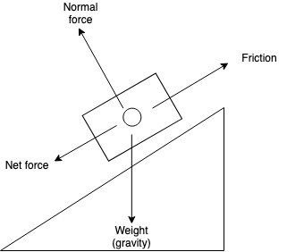

### Normal force vs. Weight

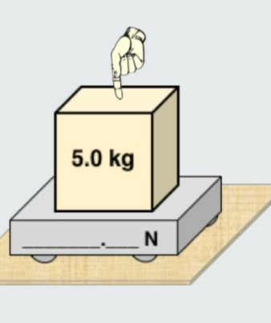

In the above diagram, we can see that the object is at rest. Two forces are primarily acting on it: the force of gravity (weight) and the normal force. However, there is another force: the applied force of the finger.

We know that the force of gravity, which we'll just call $F_g$ from now on, acts downwards, and so does the applied force ($F_a$). However, the normal force ($F_{norm}$) acts upwards.

Because the forces are balanced, we know the two downwards forces ($F_g$ and $F_a$) are required to balance to the one upward force ($F_{norm}$). This means that the normal force $F_{norm}$ is **greater than** the weight $F_g$.

### Newton's Second Law of Motion

* We know that an object in motion stays in motion..._unless_ acted on by an external force
  
  * So what happens when there _is_ an external force?

* Newton tells us that any object acted on by an external force causes _acceleration_ in the direction of the net force
  
  * This acceleration experienced is _proportional_ to the net force and _inversely proportional_ to the mass of the object

* Newton's second law of motion states that:
  
  > "The **acceleration** of an object is equal to the **net force** acting on it divided by the **mass** of the object"

* And it is often written as this famous equation:

$$
a = \frac{F_{net}}{m}
$$

$$
F_{net} = ma
$$

* This allows us to **predict** the acceleration of an object by just knowing the forces acting on it and the mass of the object

#### Using Newton's 2nd Law

* To use Newton's 2nd law, we must ensure that:
  * Our units for force are in **newtons**
  * Our units for mass are in **kilograms**
  * And our units for acceleration are in **meters per second**
* Remember that acceleration given by the 2nd law is technically in _newtons per kilogram_ ($N/kg$)
* But because one newton is equal to $1\ kg \cdot m/s^2$, and 1 newton divided by a kilogram is 1 meter per second, newtons per kilogram is **equivalent** to meters per second
* Be careful that if you use the $F = ma$ form of the 2nd law, do not get confused about causality!
  * The net force causes acceleration, not the other way around!

## Summary: Newton's 3 laws

1. An object in motion stays in motion, unless acted on by an external force (also called the **law of inertia**)
2. A net force applied to a mass will cause the mass to accelerate
3. For every action there is an equal and opposite reaction

## Finding the net force

- In most cases, it's best to calculate the net force first, and then use Newton's 2nd law
- Use this equation: $Fnet = \sum_{n} F = F_1 + F_2 + F_3 + ... + F_n$
- That's just a fancy way of saying that the net force is equal to the **sum of all forces**
- Remember that even though many of the forces will have a **negative magnitude**, this is a sum of forces! Do not assume you can just subtract the forces from each other!
- Then, to figure out the _mass_ or _acceleration_ of an object, you can then use Newton's 2nd law (since you now know the net force)
- The direction of the net force is the same direction of the acceleration, and vice-versa

## Using Newton's 2nd Law

### Force, mass, and acceleration in free fall

Free fall is a special type of motion in which the *only* force acting upon an object is gravity. In free fall, all objects experience the same acceleration - on Earth, this is approximately $10\ \mathrm{m/s^2}$. This is because an object with a greater mass also experiences a greater force of gravity, which results in the same acceleration.

The ratio of the force of gravity to mass is often called the **gravitational field strength**, and is $9.8\ \mathrm{N/kg}$ near Earth's surface (often approximated to 10 for convenience).  This causes a corresponding acceleration of $9.8\ \mathrm{m/s^2}$. Again, we like to approximate it to 10 for convenience.

Note that this is **not** the force of gravity! The gravitational field strength is a measure of the "pull" of a massive body (like a planet or star), while the force of gravity is determined by the equation $F_{grav} = mg$. Do not mistake yourself into thinking that the force of gravity is 9.8 or 10! That is the gravitational field strength!

One last question - if the elephant and the mouse have the same acceleration, why does the heavier elephant fall more quickly in real life?

The answer is because we don't live in a vaccuum - our atmosphere has air, which causes *air resistance*. As an object falls, it picks up speed. The increase in speed leads to an increase in the amount of air resistance. Eventually, the force of air resistance becomes large enough to balances the force of gravity. 

At this instant in time, the net force becomes 0, and the object will stop accelerating. The object is said to have reached a **terminal velocity**, because the change in velocity terminates as a result of the balance of forces. The object will now remain at this terminal velocity for the duration of its fall...until it smacks the ground!

### Finding the net force practice question

Let's say that you are a skydiver. At the moment you jump out of the plane, you want to know the forces on yourself. Let's try to model the situation:

Your mass is 80 kg, and you're told that you are currently at a velocity of 100 kilometers per hour. You're also told that 300 newtons of drag (air resistance) resist your movement. So let's update our force diagram below:

But if you're just jumping out the plane, we know that you accelerate downwards - the forces on you are not balanced. So which force is the stronger force? Since the net force is equal to the sum of the forces, we know that:

$$
F_{net} = F_{air-resist.} + F_{grav}
$$

Let's use that equation. The air resistance is +300 N, and the force of gravity is calculated with $F_{grav} = mg$, so it would be -800 N (approximately, because your mass is 80 kg). That means the net force is 300 N + -800 N, which yields -500 N (500 N in the downward direction).

So what is your acceleration? We can use Newton's 2nd law for that. Since the net force is -500 N, then:

$$
F_{net} = ma
$$

$$
-500\ \mathrm{N} = ma
$$

$$
-500\ \mathrm{N} = 80\ \mathrm{kg} \cdot a
$$

$$
a = \frac{-500\ \mathrm{N}}{80\ \mathrm{kg}} = -6.25\ \mathrm{m/s^2}
$$

That's your answer! You're accelerating at $-6.25\ \mathrm{m/s^2}$. That means you haven't hit terminal velocity yet, so you'll keep on getting faster!

### Creating a force diagram given mass and acceleration

First, find the net force using $F_{net} = ma$.

Next, memember that the net force is a *sum* of all forces. That means, if we had a net force of $\overrightarrow{5\ \mathrm{N}}$, and there are two forces called $a$ and $b$, then $\overrightarrow{a + b} = 5$. So $a$ and $b$ could be any two forces that add up to five. They could be 7N and -2N, 8N and -3N, etc.

### Alternate scenarios for Newton's 2nd Law

We know that the general form of Newton's 2nd Law is $a = \frac{F_{net}}{M}$. However, there are modified versions of the 2nd law in different cases.

#### Atwood's machine

In Atwood's machine, two objects are suspended from a rope. The two objects have different masses, so gravity pulls on the heavier object more than the lighter object. 

This causes an acceleration of the heavier object in the negative (down) direction, and an acceleration of the lighter object in the positive (up) direction.

$$
a = \frac{(F_{gA} - F_{gB})}{m_A + m_B}
$$

#### Modifid Atwood's machine

In the “modified Atwood’s machine”, one object is attached via a rope to another object. The pull of gravity ($F_{gA}$) on one object accelerates both objects.

Note that the modified Atwood's machine only works in a frictionless environment. In a real-life scenario, friction will act in the opposite direction of the acceleration from gravity, thus balancing the effect of gravity, and the objects will _not_ move.

So if you get this question on the test, you will be typically told to assume that there is no friction - do **not** draw friction on your force diagram!

$$
a = \frac{F_{gA}}{m_A + m_B}
$$

#### Incline force

In an incline problem (e.g. a cart sliding down an angled ramp), $\theta$ is the angle of the slope.

$$
a = \frac{F_{gA} \sin \theta}{M_a}
$$

#### Free Fall

In free fall, assuming the object is located at or near Earth, the acceleration of any object is constant at $9.8\ \mathrm{m/s^2}$.

## Friction Formula

The friction formula is:

$$
F_f = \mu F_n
$$

Here, $F_f$ is the force of friction, and $\mu$ is the friction coefficient, which is a number between 0 and 1. $F_n$ is the normal force.

## Recap on Forces

* When an object remains stationary, any forces acting on it must be balanced
* Newton's 1st Law tells us that _inertia_ causes objects to stay in motion or stay at rest
* Forces cause acceleration
* We can find the _net force_ by summing up all of the forces - remember, some of the forces are negative!
* For the same force, a greater acceleration is felt by an object with less mass, and a lesser acceleration is felt by a an object with more mass
* So, you need a greater force to cause the same amount of acceleration to an object with more mass
